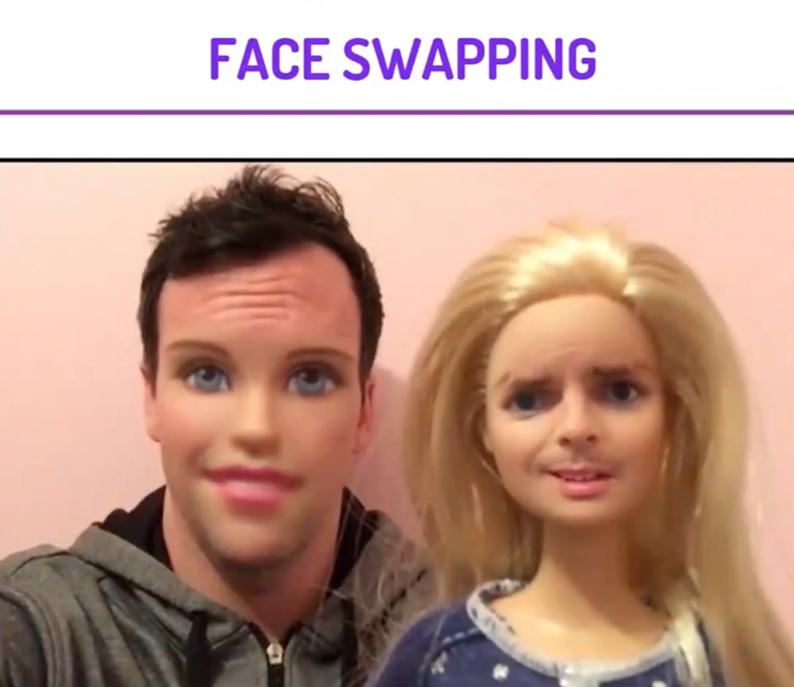

  
 

<h3> https://face-swap-flask-app.herokuapp.com/  </h3>
<i>

<i> IN THIS PROJECT, WE WILL BE USING OPENCV AND DLIB TO EXTRACT FACES OF HUMAN BEINGS FROM A GIVEN IMAGE. WE WILL USE A PRE-TRAINED MODEL TO EXTRACT LANDMARKS FROM THE FACES.
WE WILL TAKE A SOURCE IMAGE AND A DESTINATION IMAGE AND REPLACE THE FACE OF DESTINATION IMAGE WITH SOURCE IMAGE.

 

  <h2>The Steps to solve the problem </h2>

1. DOWNLOADING THE PRE TRAINED MODEL FOR SHAPE PREDICTOR  
2. CREATING A FUNCTION FOR EXTRACTING THE INDEX.  
3. LOAD THE SOURCE AND DESTINATION IMAGE FROM THE INTERNET.  
4. CONVERTING THE IMAGES INTO NUMPY ARRAY.  
5. CONVERTING IMAGES INTO GREYSCALE FOR BETTER RESULTS  
6. LOAD FACE DETECTOR AND FACE LANDMARKS PREDICTOR USING DLIB  
7. PERFORM TRIANGULATION ON THE IMAGES TO CUT OUT THE FACE  
8. CREATING EMPTY MASKS FOR IMAGES.  
9. SWAPPING THE IMAGE FOR THE FACE ON THE DESTINATION IMAGE.  
10. USING SEAMLESS CONE FOR ADJUSTING COLOR SCHEME.

  
  

<i> We will be using DLIB for this project and It's a landmark's facial detector with pre-trained models, dlib is used to estimate the location of coordinates (x, y) that map the facial points on a person's face.

This project can be used for learning and understanding different concepts of computer vision. This project can be used to build Augmented Reality applications like Snapchat, etc.

     
  
  <h1> Screenshots </h1>
  <h2> Input Screen </h2>
 
  
    
  
<h2> Output Screen </h2> 

   
    

### Give It a Star if you liked the project 
